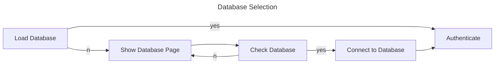

# My-Passwords

A hand-made easy-to-remember password generator and manager. Made with Tauri, Svelte and ♥.

## Database Stuff

Start DB in memory

```sh
surreal start --strict memory
```

*or via Surrealist.*

First time-init:

```pwsh
cd .\database\
cargo run
```

Start DB on server

```sh
$ sudo nano /etc/systemd/system/surrealdb.service
[Unit]
Description=SurrealDB Server
After=network.target

[Service]
ExecStart=/path/to/surrealdb start --strict --auth --user [ROOT_USER_NAME] --pass [ROOT_USER_PASSWORD] file:/home/surreal-runner/mydatabase.db
Restart=always
User=surreal-runner

[Install]
WantedBy=multi-user.target

$ sudo systemctl daemon-reload
$ sudo systemctl enable surrealdb
$ sudo systemctl start surrealdb
```

```sh
surreal start --strict --auth --user [ROOT_USER_NAME] --pass [ROOT_USER_PASSWORD] 
```

## Workflow



## Roadmap

- [ ] Beta v0.1
  - [x] Create Secure
  - [x] Secure Password Site
  - [x] Edit Secure
  - [x] Delete Secure
  - [x] Store PIN and SECRET on local
  - [x] Store Special-Chars in DB
  - [x] For Super-Secure-Case: Replace "year" with "seed" -> must be equal to seed = year%3 so that seed%3
  - [x] Super Secure Algo
  - [x] Create Super Secure
  - [x] Super Secure Password Site
  - [x] Create SSO
  - [x] SSO Password Site
  - [x] Legacy Password Site
  - [x] List of all Passwords
  - [x] Store Recent Searched / Popular Searches
  - [x] Create Buckets
  - [x] Delete Buckets
  - [x] Reorga main page -> Create Bucket must be possible from there
  - [x] Import Script for Legacy
  - [x] Dynamic Username Top left corner
  - [x] Wallpaper Credits auf Logic Page und in pot. Footer
  - [x] Change version numbers & author information in all config files (Cargo.toml, package.json, etc.)
  - [ ] GitHub Action aufsetzen
  - [x] SurrealDB aufsetzen (Mit HTTPS und systemd) <https://surrealdb.com/docs/surrealdb/cli/start>
- [ ] Version Backlog
  - [ ] Run Clippy and remove all println / dbg / console.log and all other warnings
  - [ ] Enable and redo "Load Lagacy JSON"
  - [ ] Improve Error Handling -> Propably propergate the errors from DB and enrich with more information
  - [ ] Input Sanitation or general better security
  - [ ] Improve DB Connection Page
  - [ ] Offline Mode
  - [ ] Make own Delete-Bucket dialog
  - [ ] Manage Buckets
  - [ ] Create 2FA
  - [ ] Manage 2FA
  - [ ] Archive - Handling
  - [ ] Dashboard with Statistics
  - [ ] Create Hand-Written Passwords
  - [ ] Random Bucket Wallpaper as theme
  - [ ] Custom Theme builder einbauen & themes local speichern
  - [ ] Options Page
  - [ ] Drag n Drop resorting of accounts into Buckets on the List Page ([Example](https://svelte.dev/repl/b225504c9fea44b189ed5bfb566df6e6?version=4.2.18))
  - [ ] Accessibility
  - [ ] Automaticly search for institution website and write it to acc-page
  - [ ] Add search-aliases for institutions
  - [ ] Add a password history to the password page (link disabled accounts)
  - [ ] SuperSecure Mode: Make it time-dependend, e.g. IBM requests password change every 3 months
